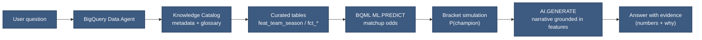
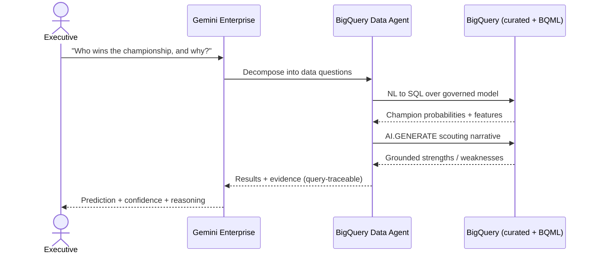
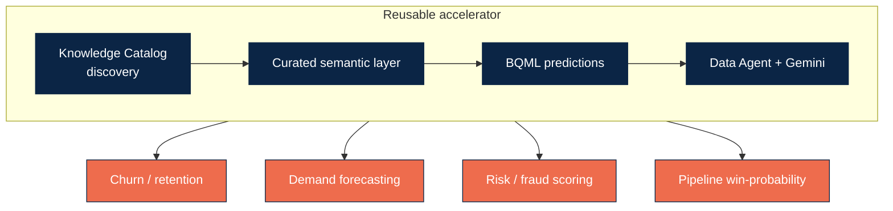

# Agentic Architecture — Diagrams (Lucidchart-ready)

These diagrams describe the NCAA Championship Predictor agentic solution.
**Import into Lucidchart:** Insert → Diagram → *Mermaid* (or the Mermaid shape),
paste one code block at a time.

---

## 1. End-to-end agentic architecture

```mermaid
flowchart TB
    subgraph USER["Users"]
        EX["Executive / Analyst"]
    end

    subgraph ORCH["Reasoning & Orchestration"]
        GEM["Gemini Enterprise<br/>(conversation, reasoning, synthesis)"]
        AGENT["BigQuery Data Agent<br/>(NL to SQL, grounded in Knowledge Catalog)"]
    end

    subgraph GOV["Governed Semantic Layer — BigQuery"]
        CUR["Curated tables<br/>feat_/fct_/dim_"]
        BQML["BQML models<br/>ML.PREDICT"]
        AIGEN["AI.GENERATE routines<br/>scouting narratives"]
        SIM["Bracket simulation<br/>champion probabilities"]
    end

    subgraph SRC["Sources (read-only)"]
        RAW["ncaa_basketball<br/>raw tables"]
        SCAN["ncaa_basketball_scan_results<br/>Dataplex profiles"]
        CAT["Knowledge Catalog<br/>NCAA Basketball Glossary"]
    end

    EX -->|"Who wins & why?"| GEM
    GEM -->|delegates data questions| AGENT
    AGENT -->|trusted SQL| CUR
    AGENT --> BQML
    AGENT --> AIGEN
    CUR --> SIM
    BQML --> SIM
    SIM -->|P(champion) per team| AGENT
    AIGEN -->|grounded narrative| AGENT
    AGENT -->|results + evidence| GEM
    GEM -->|answer + confidence| EX

    RAW --> CUR
    SCAN --> CUR
    CAT --> AGENT
    CAT --> AIGEN

    classDef user fill:#EE6C4D,stroke:#0B2545,color:#fff;
    classDef orch fill:#0B2545,stroke:#0B2545,color:#fff;
    classDef gov fill:#3D5A80,stroke:#0B2545,color:#fff;
    classDef src fill:#E0FBFC,stroke:#3D5A80,color:#0B2545;
    class EX user;
    class GEM,AGENT orch;
    class CUR,BQML,AIGEN,SIM gov;
    class RAW,SCAN,CAT src;
```

---

## 2. Grounding chain (how every claim traces to data)



---

## 3. Request sequence (runtime)



---

## 4. Consulting reuse pattern (66degrees)


